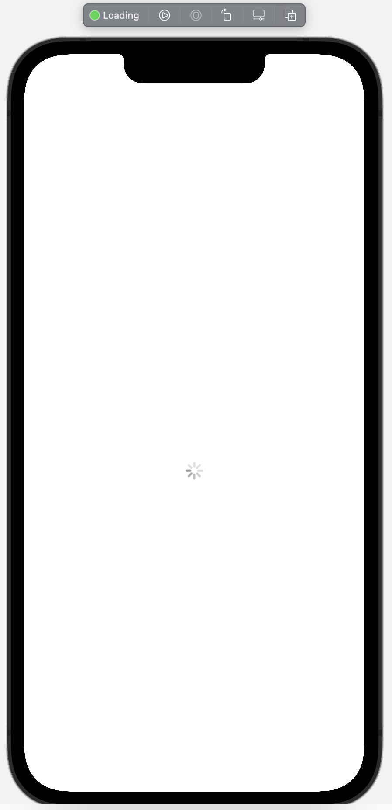
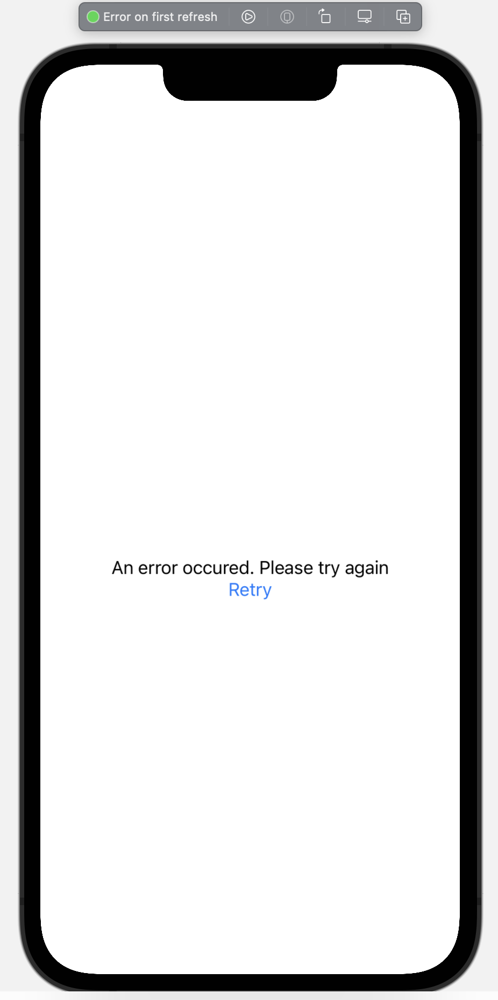
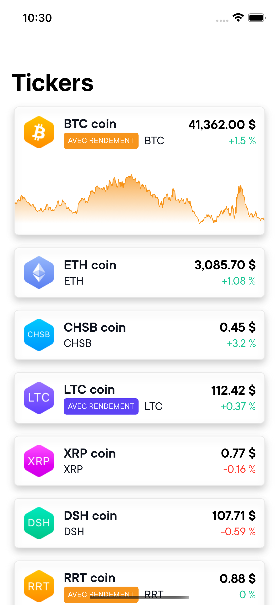
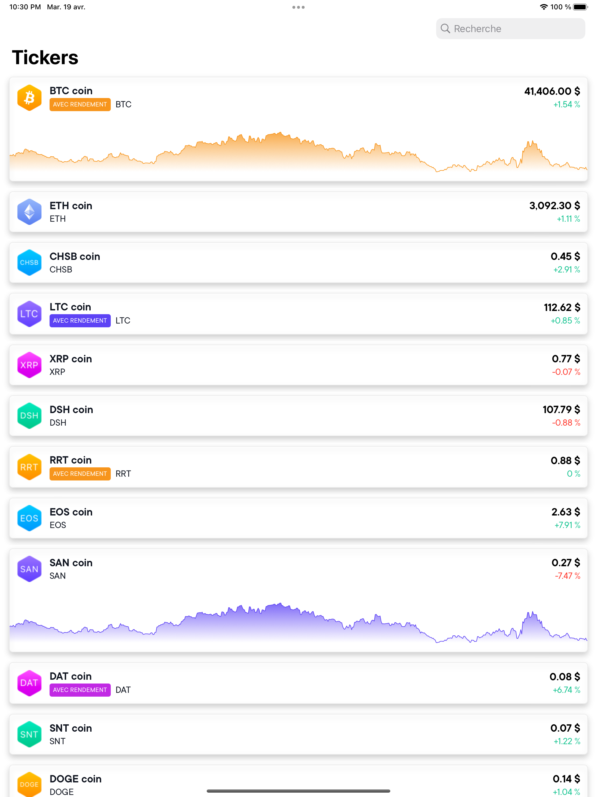
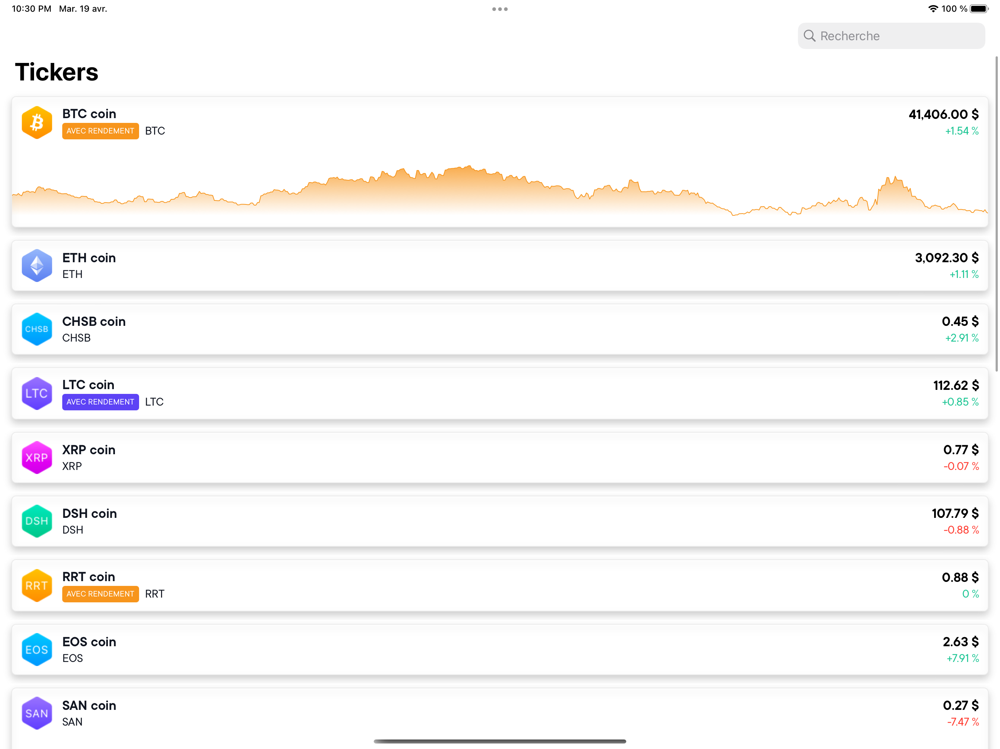

#  SwissBorgTickers

## Installation and running

The projects relies on SPM to install dependencies. You can run it on both iPad and iPhone.
I strongly suggest not using the iPod touch or anything around 320 px wide. See know issues

## Preview all views

Views have been designed with SwiftUI. You can preview them and their states
See for example

## Known issues

Because I spent a bit too much time on the project and I had to stop at some point:
- The graph is not really efficient. It's only here because I wanted to test SwiftUI against the SwissBorg design.
- Not everything is unit tested, but the VM should be fine. I also tried to test the extensions amongst other things like the service, ...
- It was my first time using Moya so I might not be using it 100% correctly. It gave me some headaches regarding stubbing behavior
- The VM uses both Combine and RxSwift. RxSwift is more mature so I used it here but I still need to bridge it with SwiftUI using Combine. There might be more efficient way though.
- The UI has some issues on smaller screens, again: fixable but I don't think it was the purpose here anyway.
- I usually use SwiftLint and/or SwiftFormat. But it's not the case here, I focused on delivering something rather than some project management. Same goes for code generation like Sourcery for UT helpers.

## Screenshots

